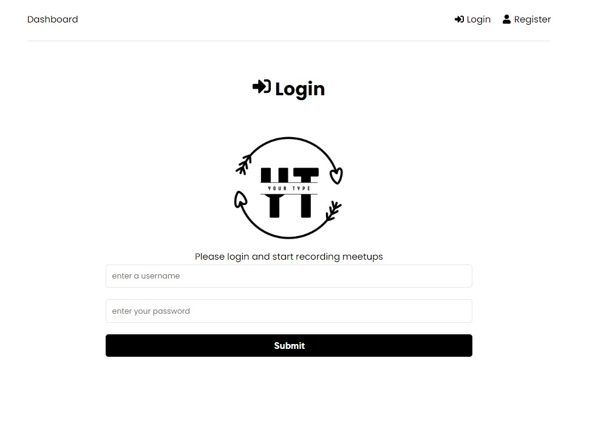
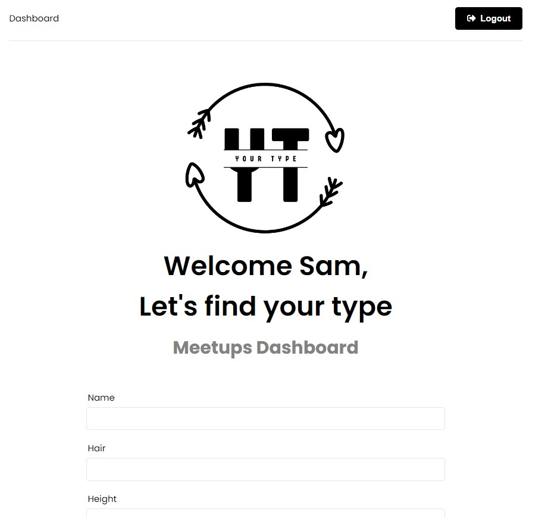

# Your Type
  
## Description
Web appliation to assist with people with cataloguing their date experiences and finding which attributies they find in people the most attractive and appealing. 

Page is responsive and gives users a good experience in mobile view. 
## Table of Contents
- [Instation Instructions](#installation-instructions)
- [Usage Instructions](#usage-instructions)
- [Screen Shots](#screen-shots)
- [Repository Link](#repository-link)
- [References](#references)

## Installation Instructions
Put the following commands into your terminal before running the server.js
// npm init
// npm i express
// npm i 

## Usage Insturctions

Please install all packages before starting. 

Make sure to update the .env file to assist with a database

## Screen Shots
Login Page  

Dashboard  

Saved Meetups Page  

## Repository Link
To find out more information about this repo please visit my github page https://github.com/Samw1s3/your-type2

## References
https://stackoverflow.com/
https://www.w3schools.com/sql/sql_join.asp
https://www.youtube.com
